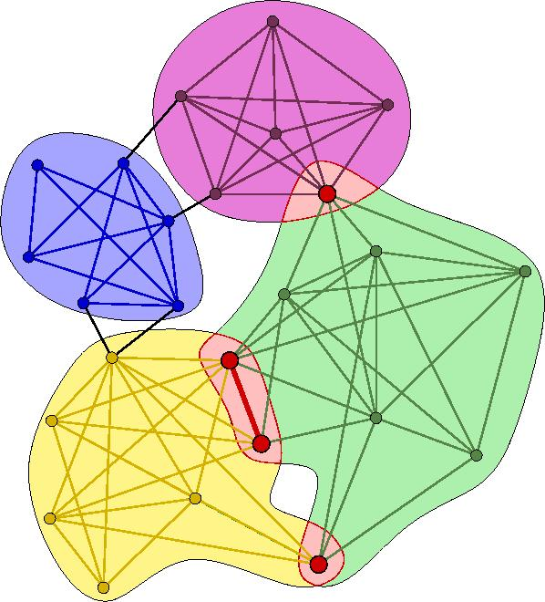

CSCI 596 - Final Project: Distributed Memory K-Clique Enumeration

Members: Christopher Fucci, Kartik Lakhotia, Niki Tavakoli

Project Goal: We are exploring shared + distributed memory parallelism to enumerate cliques

Approach: 
Store graph on every node; the vertex set will then be divided into several small subsets. There will be a common queue of the subset IDs, and each node pulls an index from the queue and computes the cliques for that subset of vertices. The goal is to expand deep clique discovery through shared memory so that graphs of larger magnitude can be analyzed.

Methods utilized: MPI_Send/Receive, MPI_Get/Put, and MPI_Win_lock
